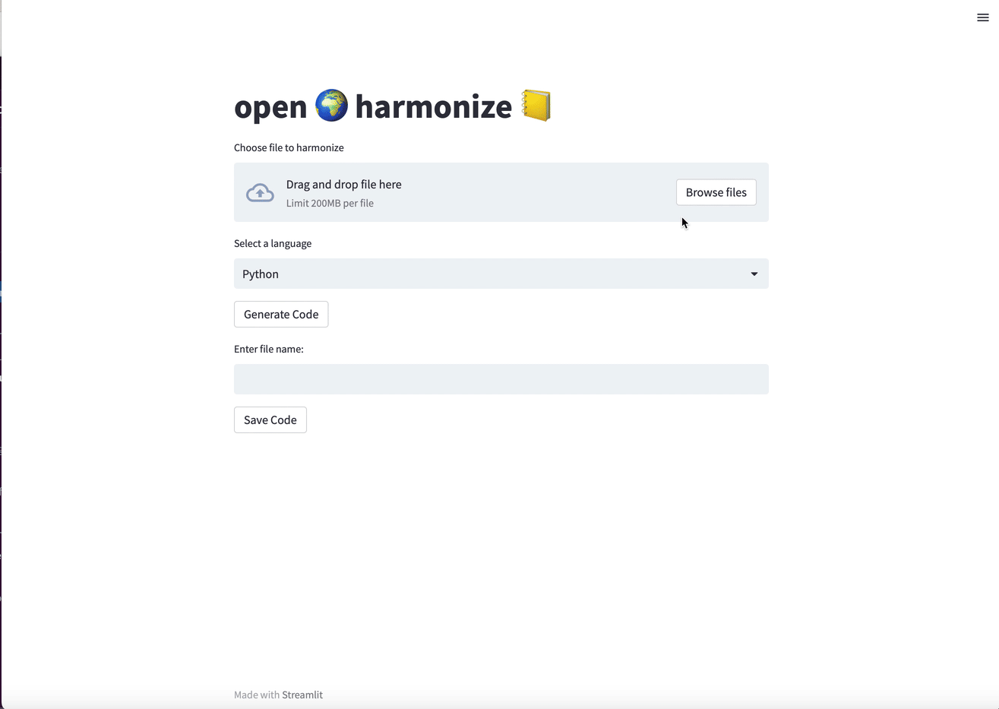

# harmonizer

Streamlit app to generate code for Open Earth Foundation harmonizer

**Steps:**
- Go to link
- Upload file (accepted formats are csv and xlsx)
- Code will automatically be generated


**Future iterations:**
- Create agent to test code and modify to fit the prompt

**To run**

```python
streamlit run app.py
```
You need to set the following environment variables in a .env file:

- OPENAI_API_KEY
- DATASET_PATH
- ACTIVELOOP_TOKEN

### Demo


